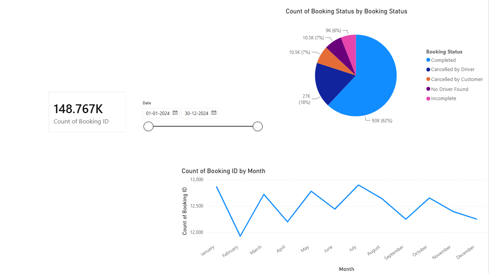
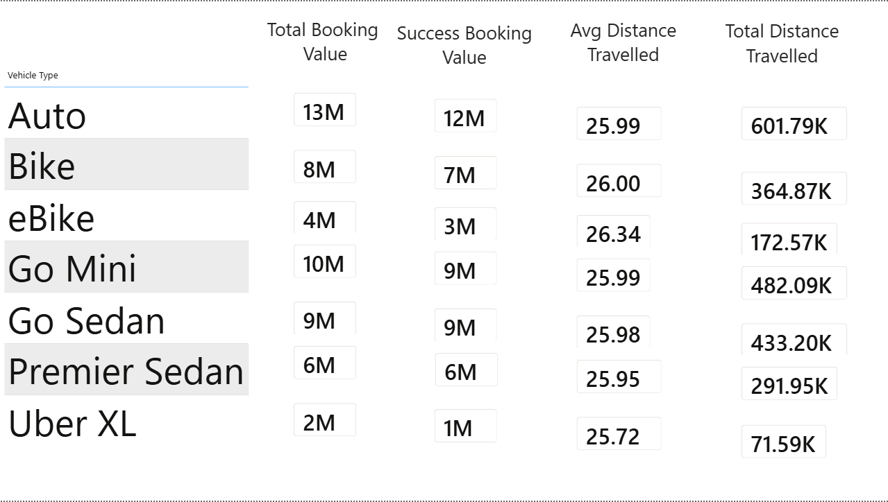
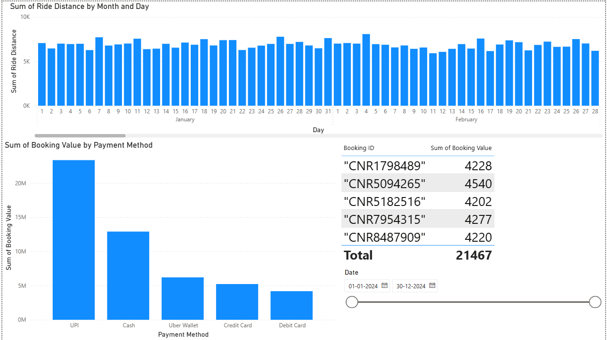
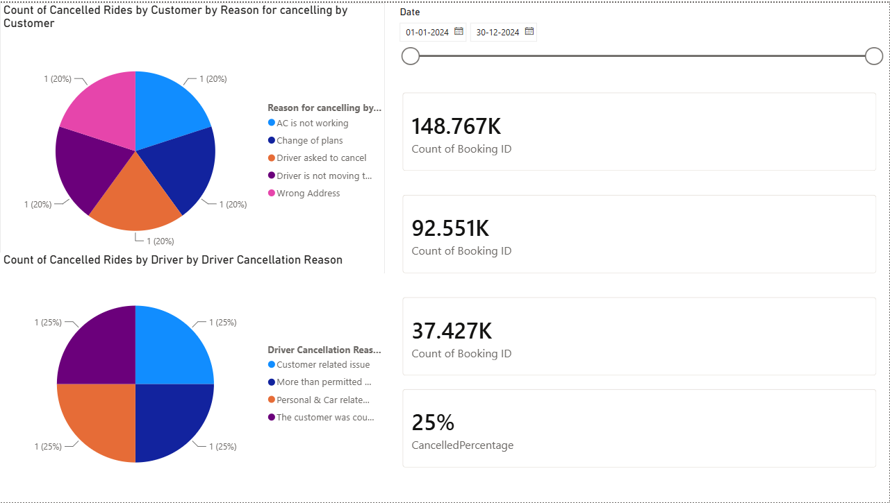
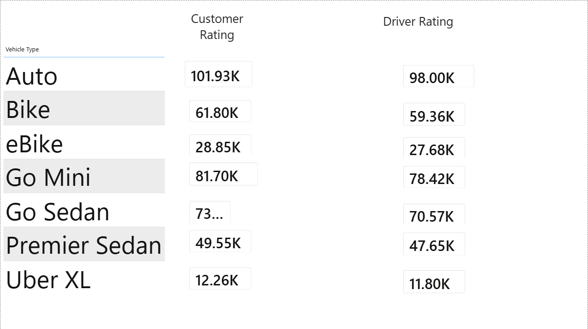
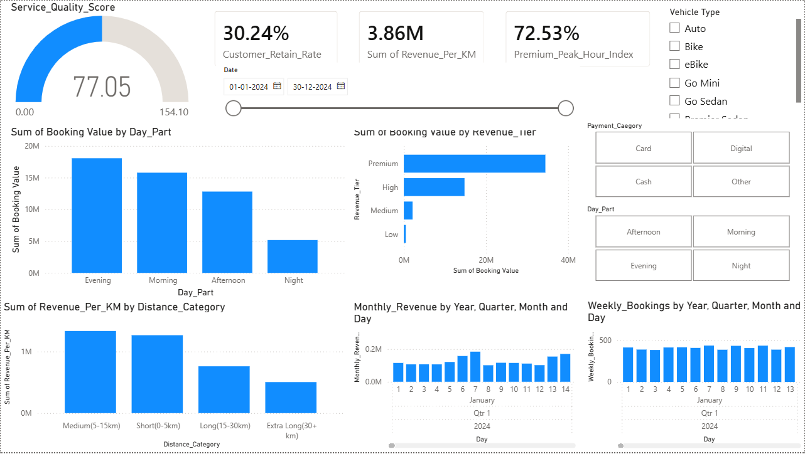

# Taxi Ride Analytics Dashboard using Power BI

## Overview

This project is an end-to-end Business Intelligence and Data Analytics solution developed using Power BI. The dashboard analyzes taxi booking operations and provides actionable insights into customer behavior, ride performance, revenue generation, cancellation patterns, vehicle utilization, and service quality.

The objective of this project is to transform raw booking data into meaningful business insights that can help management optimize operations, improve customer satisfaction, reduce cancellations, and increase revenue.

---

## Project Objectives

- Analyze overall taxi booking performance.
- Monitor ride completion and cancellation rates.
- Identify high-performing vehicle categories.
- Understand customer and driver behavior.
- Evaluate payment method preferences.
- Track revenue and booking trends over time.
- Measure service quality and customer retention.
- Provide data-driven recommendations for business growth.

---

## Tools & Technologies Used

### Data Analytics
- Power BI Desktop
- Microsoft Excel

### Data Preparation
- Power Query
- Data Cleaning
- Data Transformation

### Data Modeling
- Data Relationships
- Star Schema Concepts

### Visualization
- Interactive Dashboards
- KPI Cards
- Pie Charts
- Bar Charts
- Line Charts
- Slicers
- Drill-down Analysis

### DAX
- Calculated Measures
- Aggregations
- Percentage Metrics
- KPI Calculations

---

## Dataset Information

The dataset contains taxi ride booking records including:

- Booking ID
- Ride Status
- Vehicle Type
- Customer Rating
- Driver Rating
- Payment Method
- Booking Value
- Ride Distance
- Cancellation Reasons
- Booking Date
- Revenue Metrics

The dataset was cleaned, transformed, and modeled before visualization.

---

## Dashboard Pages

### 1. Overview Dashboard

Provides a high-level summary of taxi operations.

#### Key Metrics
- Total Bookings
- Booking Status Distribution
- Monthly Booking Trends
- Completed vs Cancelled Rides

#### Insights
- More than 148K bookings analyzed.
- Majority of rides were successfully completed.
- Seasonal booking trends identified across months.

---

### 2. Vehicle Performance Dashboard

Analyzes performance across different vehicle categories.

#### Vehicle Types
- Auto
- Bike
- eBike
- Go Mini
- Go Sedan
- Premier Sedan
- Uber XL

#### Metrics
- Total Booking Value
- Successful Booking Value
- Average Distance Travelled
- Total Distance Travelled

#### Business Value
- Identifies highest revenue-generating vehicle categories.
- Helps optimize fleet allocation and operational efficiency.

---

### 3. Revenue & Payment Analysis Dashboard

Analyzes financial performance and payment behavior.

#### Metrics
- Total Booking Revenue
- Revenue per Kilometer
- Revenue by Customer Segment
- Revenue by Distance Category

#### Payment Methods
- UPI
- Cash
- Credit Card
- Debit Card
- Wallet

#### Insights
- UPI emerged as the most preferred payment method.
- Premium customers generated the highest revenue contribution.
- Revenue trends provide visibility into customer spending patterns.

---

### 4. Cancellation Analysis Dashboard

Examines ride cancellations from both customer and driver perspectives.

#### Customer Cancellation Reasons
- AC Not Working
- Change of Plans
- Driver Asked to Cancel
- Driver Delay
- Wrong Address

#### Driver Cancellation Reasons
- Customer Related Issues
- Personal Reasons
- Vehicle Related Problems
- Distance Related Issues

#### Metrics
- Total Bookings
- Completed Rides
- Cancelled Rides
- Cancellation Percentage

#### Business Value
- Helps identify operational inefficiencies.
- Enables targeted strategies to reduce cancellations.

---

### 5. Customer & Driver Ratings Dashboard

Evaluates service quality through ratings analysis.

#### Metrics
- Customer Ratings
- Driver Ratings

#### Vehicle-wise Analysis
- Auto
- Bike
- eBike
- Go Mini
- Go Sedan
- Premier Sedan
- Uber XL

#### Business Value
- Measures customer satisfaction levels.
- Identifies service quality gaps and improvement opportunities.

---

### 6. Service Quality & Retention Dashboard

Advanced business performance analysis dashboard.

#### KPIs
- Service Quality Score
- Customer Retention Rate
- Revenue per Kilometer
- Premium Peak Hour Index

#### Analysis Dimensions
- Revenue Tier
- Distance Category
- Day-Part Analysis
- Weekly Booking Trends
- Monthly Revenue Trends

#### Business Value
- Supports strategic decision-making.
- Helps improve customer retention and revenue generation.

---

## Data Cleaning & Transformation

The following preprocessing steps were performed:

- Removed duplicate records.
- Handled missing values.
- Standardized categorical variables.
- Converted date formats for analysis.
- Created calculated columns and measures.
- Developed DAX formulas for KPI calculations.
- Optimized data model relationships.

---

## Key Insights

### Booking Performance
- More than 148K bookings were analyzed.
- Completed rides accounted for the majority of bookings.
- Booking demand remained relatively stable throughout the year.

### Revenue Insights
- Premium ride categories generated the highest revenue.
- UPI was the dominant payment method.
- Evening rides contributed the highest booking value.

### Cancellation Insights
- Customer and driver cancellations contributed significantly to operational losses.
- Repeated cancellation reasons indicate opportunities for process improvement.

### Customer Experience
- Customer and driver ratings remained consistent across vehicle categories.
- Premium services generally received better ratings.

### Business Growth Opportunities
- Improve cancellation management processes.
- Encourage digital payment adoption.
- Expand premium service offerings.
- Implement customer retention initiatives.

---

## Skills Demonstrated

### Data Analytics
- Exploratory Data Analysis (EDA)
- Business Intelligence
- KPI Development
- Insight Generation

### Power BI
- Interactive Dashboard Development
- DAX Measures
- Power Query
- Data Modeling

### Business Analysis
- Revenue Analysis
- Customer Analytics
- Service Quality Analysis
- Operational Analytics

### Data Handling
- Data Cleaning
- Data Transformation
- Data Validation
- Data Visualization

---

## Future Improvements

- Real-time dashboard integration.
- Predictive ride demand forecasting.
- Customer churn prediction.
- Dynamic pricing recommendation system.
- Driver performance scoring.
- Geospatial ride analysis using maps.

---

## Project Screenshots

### Overview Dashboard

### Vehicle Performance Dashboard

### Revenue Analysis Dashboard

### Cancellation Analysis Dashboard

### Customer & Driver Ratings Dashboard

### Service Quality Dashboard

---

## Project Structure

Taxi-Ride-Analytics-PowerBI/
│
├── Taxi_Ride_Analytics.pbix
├── README.md
├── Dataset/
│ └── taxi_booking_dataset.xlsx
│
└── Screenshots/
├── overview_dashboard.png
├── vehicle_performance.png
├── revenue_analysis.png
├── cancellation_analysis.png
├── ratings_dashboard.png
└── service_quality_dashboard.png

---

## Author

### Utkarsh Gupta

B.Tech Computer Science (Data Science)  
Pranveer Singh Institute of Technology (PSIT), Kanpur

#### Skills
- Python
- SQL (PostgreSQL)
- Power BI
- Advanced Excel
- Machine Learning
- Data Analytics
- Data Visualization

#### Connect With Me

**LinkedIn:** https://www.linkedin.com/in/utkarsh-gupta-profile/

**GitHub:** https://github.com/utkarshgupta-22

Through this project, I applied data analytics, visualization, and business intelligence techniques to transform raw booking data into actionable business insights.
